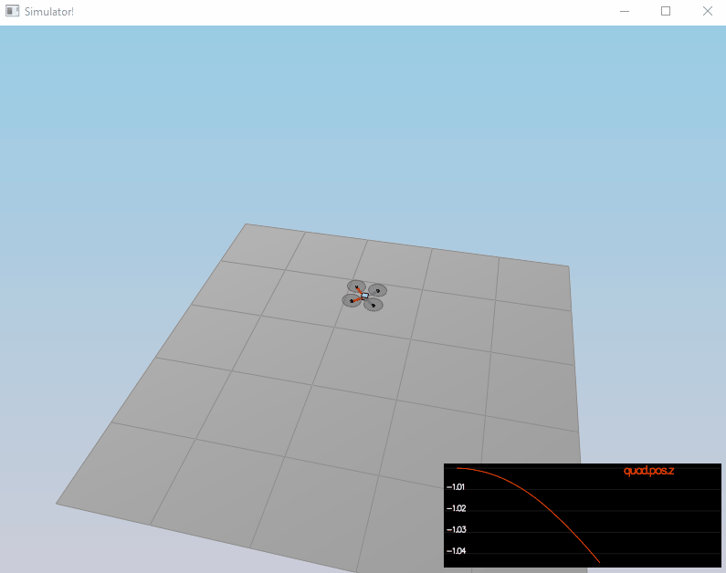
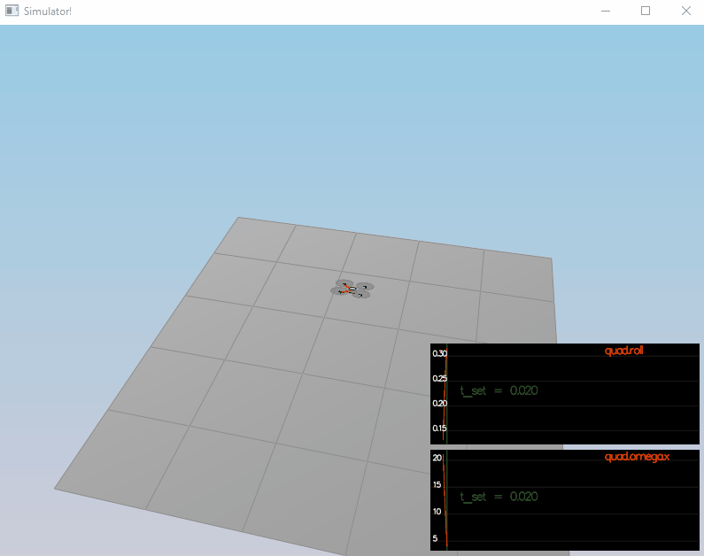
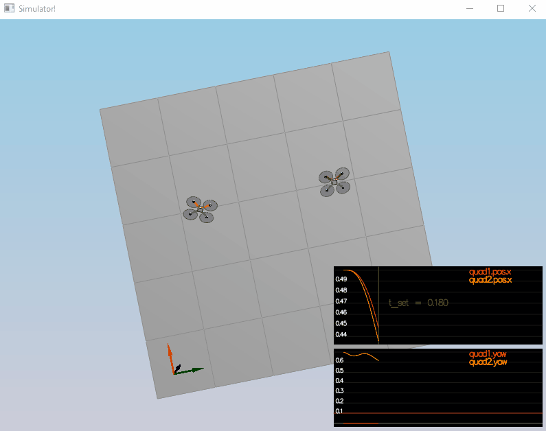
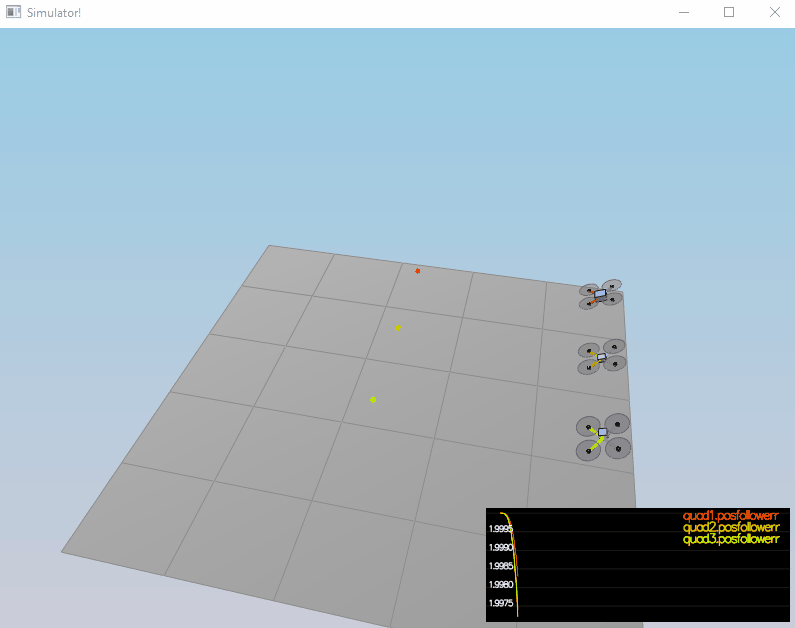
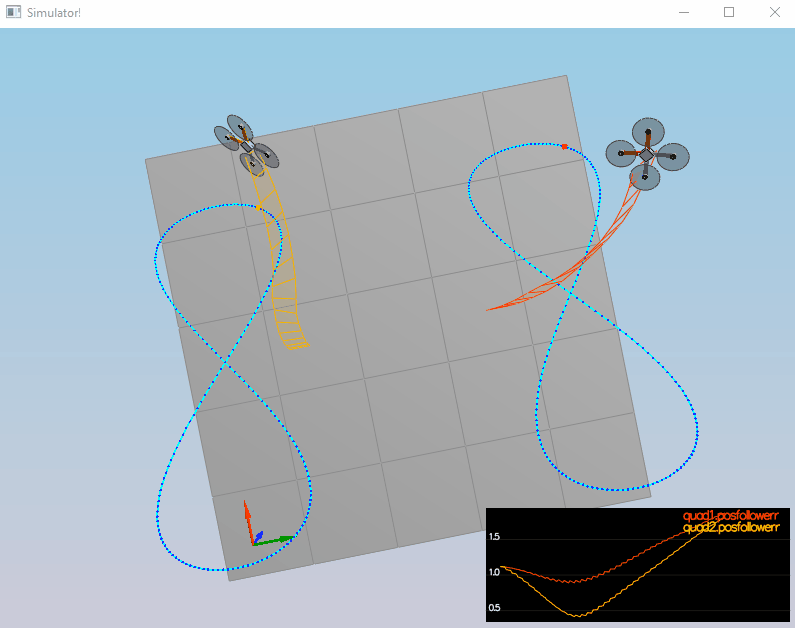

#### Provide a Writeup / README that includes all the rubric points and how you addressed each one. You can submit your writeup as markdown or pdf

You are reading the writeup.

#### Implemented body rate control in C++

It is implemented in `QuadControl::BodyRateControl` function

```c++
V3F QuadControl::BodyRateControl(V3F pqrCmd, V3F pqr)
{
  V3F momentCmd;
  momentCmd = V3F(Ixx, Iyy, Izz)*kpPQR*(pqrCmd - pqr);
  return momentCmd;
}
```

#### Implement roll pitch control in C++

It is implemented in `QuadControl::RollPitchControl` function

```c++
V3F QuadControl::RollPitchControl(V3F accelCmd, Quaternion<float> attitude, float collThrustCmd)
{
  V3F pqrCmd;
  Mat3x3F R = attitude.RotationMatrix_IwrtB();

  float c_d = collThrustCmd / mass;
  float target_R13 = CONSTRAIN(accelCmd.x / c_d, -maxTiltAngle, maxTiltAngle);
  float target_R23 = CONSTRAIN(accelCmd.y / c_d, -maxTiltAngle, maxTiltAngle);

  pqrCmd.x = (-R(1, 0)*kpBank*(R(0, 2) - target_R13) + R(0, 0)*kpBank*(R(1, 2) - target_R23)) / R(2, 2);
  pqrCmd.y = (-R(1, 1)*kpBank*(R(0, 2) - target_R13) + R(0, 1)*kpBank*(R(1, 2) - target_R23)) / R(2, 2);
  pqrCmd.z = 0;

  return pqrCmd;
}
```

#### Implement altitude controller in C++

It is implemented in `QuadControl::AltitudeControl` function

```c++
float QuadControl::AltitudeControl(float posZCmd, float velZCmd, float posZ, float velZ, Quaternion<float> attitude, float accelZCmd, float dt)
{
  Mat3x3F R = attitude.RotationMatrix_IwrtB();
  float thrust = 0;

  integratedAltitudeError += (posZCmd - posZ)*dt;

  float hdot_cmd = CONSTRAIN(kpPosZ * (posZCmd - posZ) + velZCmd, -maxAscentRate, maxDescentRate);
  float acceleration_cmd = accelZCmd + kpVelZ * (hdot_cmd - velZ) + KiPosZ * integratedAltitudeError;
  thrust = mass * (CONST_GRAVITY - acceleration_cmd) / R(2, 2);
  
  return thrust;
}
```

#### Implement lateral position control in C++

It is implemented in `QuadControl::LateralPositionControl` function

```c++
V3F QuadControl::LateralPositionControl(V3F posCmd, V3F velCmd, V3F pos, V3F vel, V3F accelCmdFF)
{
  accelCmdFF.z = 0;
  velCmd.z = 0;
  posCmd.z = pos.z;

  V3F accelCmd = accelCmdFF;

  accelCmd -= kpPosXY * (posCmd - pos) + kpVelXY * (velCmd - vel);
  accelCmd.z = 0;

  if (accelCmd.mag() > maxAccelXY) accelCmd = accelCmd.norm()*maxAccelXY;

  return accelCmd;
}
```

#### Implement yaw control in C++

It is implemented in `QuadControl::YawControl` function.

```c++
float QuadControl::YawControl(float yawCmd, float yaw)
{
  float yawRateCmd=0;
  yawCmd = fmodf(yawCmd, 2*M_PI);
  float yawError = yawCmd - yaw;

  if (yawError > M_PI) yawError -= 2 * M_PI;
  if (yawError < -M_PI) yawError += 2 * M_PI;

  yawRateCmd = kpYaw * yawError;
  return yawRateCmd;
}
```

#### Implement calculating the motor commands given commanded thrust and moments in C++

It is implemented in `QuadControl::GenerateMotorCommands` function.

```C++
VehicleCommand QuadControl::GenerateMotorCommands(float collThrustCmd, V3F momentCmd)
{
  float taux_l = momentCmd.x / L * sqrtf(2);
  float tauy_l = momentCmd.y / L * sqrtf(2);
  float tauz_kappa = momentCmd.z / kappa;

  cmd.desiredThrustsN[0] = (collThrustCmd + taux_l + tauy_l - tauz_kappa) / 4.f;
  cmd.desiredThrustsN[1] = (collThrustCmd - taux_l + tauy_l + tauz_kappa) / 4.f;
  cmd.desiredThrustsN[2] = (collThrustCmd + taux_l - tauy_l + tauz_kappa) / 4.f;
  cmd.desiredThrustsN[3] = (collThrustCmd - taux_l - tauy_l - tauz_kappa) / 4.f;

  return cmd;
}
```

#### Your C++ controller is successfully able to fly the provided test trajectory and visually passes inspection of the scenarios leading up to the test trajectory









